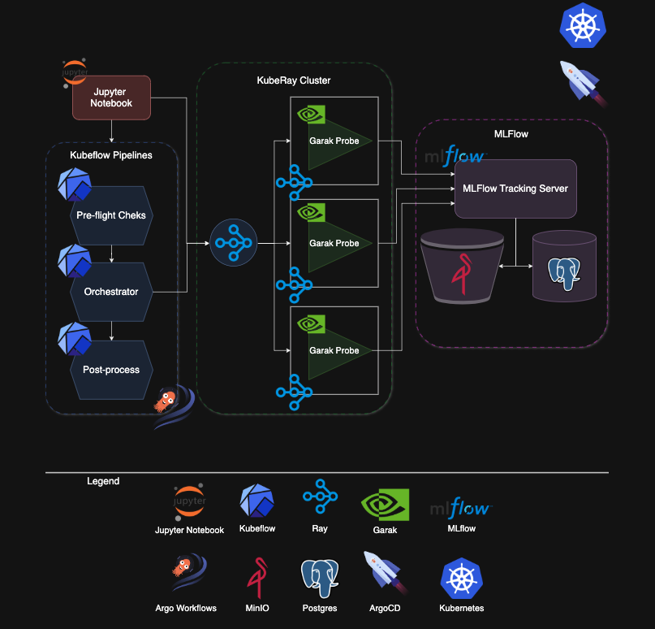

# MADRIGAL: A blueprint for Distributed GenAI Red Teaming using open-source tooling
 
A Kubernetes-native reference architecture for performing and tracking distributed GenAI Red Teaming using open-source technologies such as Garak, Ray and MLFlow

## What is MADRIGAL?
Modular Architecture for Distributed Red TeamIng on GenerAtive LLMs (MADRIGAL) is a reference architecture that pieces together open-source technologies for performing GenAI Red Teaming in a distributed manner on Kubernetes. It employs the following:

- [Garak](https://github.com/NVIDIA/garak) for performing GenAI Red Teaming
- [Ray](https://github.com/ray-project/ray) for running the Red Teaming in a distributed manner
- [Kubeflow Pipelines](https://github.com/kubeflow/pipelines) for making the Red Teaming operationally reproducible and scheduled if necessary
- [MLflow](https://github.com/mlflow/mlflow) for keeping track of the resulting hit logs and reports generated

## Architecture and Components

## Key Features

- **Scalability**: Leverages KubeRay for running distributed tasks, making it easy to scale up or down based on load.
- **Reproducibility**: All infrastructure is declared via YAML files in `k8s/argocd_apps`, which Argo CD uses to automatically synchronize and deploy your applications.
- **Modularity**: The pipeline consists of discrete components (`preflight_checks`, `run_distrt`, and `post_process`) that can be reused or extended.
- **Experiment Tracking**: Integrates with MLflow to record runs, artifacts, and logs of your distributed red-teaming tasks.
- **Customizable**: Easily switch out or add new probes in `distributed_redteaming.ipynb` or `distrt_pipeline.py` to target the specific vulnerabilities you want to test.

---

## Setup Guide

For a step-by-step installation guide, refer to [SETUP.md](SETUP.md). It explains:

1. How to create a **multi-node MicroK8s cluster** on services like DigitalOcean or other Kubernetes providers.  
2. How to install **Argo CD** and apply the YAML files in `k8s/argocd_apps` to set up Kubeflow Pipelines, KubeRay, MLflow and Argo Workflows.
3. Tips for ensuring you have adequate resources (CPU, RAM) before hosting large language models and other demanding components.

---

## Code Overview

Below is a table describing the main code-related files and folders in this repository.

| File / Folder                                                               | Description                                                                                                                                                                                                                                                                                                         |
|-----------------------------------------------------------------------------|---------------------------------------------------------------------------------------------------------------------------------------------------------------------------------------------------------------------------------------------------------------------------------------------------------------------|
| [SETUP.md](SETUP.md)                                                        | Contains a detailed **installation guide** for setting up a multi-node Kubernetes cluster using MicroK8s, deploying Argo CD, and configuring MLflow, KubeRay, and Kubeflow Pipelines.  |
| [k8s/bootstrap/microk8s_setup.sh](k8s/bootstrap/microk8s_setup.sh)         | A **script** for setting up a multi-node MicroK8s cluster, including node joining and essential add-on configurations. It simplifies the process of creating and maintaining a Kubernetes environment on platforms like Digital Ocean.                                                                            |
| [k8s/bootstrap/argocd_setup.sh](k8s/bootstrap/argocd_setup.sh)             | A **bash script** that installs and initializes Argo CD on your Kubernetes cluster. Running this sets up the Argo CD namespace, controller, and server, providing a central UI for continuous delivery of your applications.                                                                                       |
| [k8s/argocd_apps](k8s/argocd_apps)                                          | This folder contains **YAML files** that Argo CD uses to create and manage various applications, such as Kubeflow Pipelines, MLflow, MinIO, and RayCluster. When these files are applied and synced, Argo CD synchronizes and deploys the configurations in your Kubernetes environment.                        |
| [k8s/bootstrap/useful_commands.sh](k8s/bootstrap/useful_commands.sh)       | A **shell script** with convenient commands for port-forwarding services, retrieving secrets (for Argo CD or Argo Workflows), and terminating processes on specific ports. It serves as a quick reference for frequent tasks in a Kubernetes + Argo + Kubeflow environment.                                        |
| [src/verify_connections.ipynb](src/verify_connections.ipynb)              | A **Jupyter notebook** for testing connectivity to components in the K8s cluster, such as Ray, Kubeflow Pipelines and MLflow.                                                                                                   |
| [src/download_hf_model.ipynb](src/download_hf_model.ipynb)                | A **notebook** for downloading a model from Hugging Face and logging it to MLflow. This model is used as the LLM against which Red Teaming is performed. The model used in this example is `HuggingFaceTB/SmolLM2-135M-Instruct`                                                                                                    |
| [src/distributed_redteaming.ipynb](src/distributed_redteaming.ipynb)       | A short **Jupyter notebook** for running the distributed red teaming interactively to get a sense of what is happening.                                                                                                                                         |
| [src/custom_generator.py](src/custom_generator.py)                         | A **Python script** that downloads a model from MLflow and defines a custom text-generation function. This is used in the [src/distributed_redteaming.ipynb](src/distributed_redteaming.ipynb) notebook as the generator function passed to garak for Red Teaming |
| [src/distrt_pipeline.py](src/distrt_pipeline.py)                           | A **Python script** defining a Kubeflow pipeline that performs distributed Red Teaming non-interactively. The Kubeflow pipeline generated by this code can be found in [src/madrigal_pipeline.yaml](src/madrigal_pipeline.yaml) |
| [src/kfp_launcher.ipynb](src/kfp_launcher.ipynb)                           | A **Jupyter notebook** demonstrating how to compile, register and run the Kubeflow Pipeline programmatically. It allows you to experiment with pipeline settings and trigger runs without manually using the Kubeflow UI.                                                                                                   |

## Things to Watch Out For

1. **Obtain Authorization**  
   Always confirm you have permission to conduct red teaming. Unauthorized tests can carry legal and ethical risks. Ensure your scope and objectives are crystal clear and approved by relevant stakeholders.

2. **Handling Harmful Text**  
   When probing generative models for malicious or toxic outputs, you may encounter unsettling content. Refer to [“Working with Harmful Text”](https://aclanthology.org/2022.findings-emnlp.35/) for guidance on ethical and emotional considerations. Plan how you’ll filter, store, and handle any disturbing text responsibly.

3. **Keep an Eye on Costs**  
   Large-scale testing can escalate usage fees, particularly if you rely on external APIs. Tools like Garak may generate many requests in a short time. Configure usage limits or monitoring dashboards to avoid surprising bills.

4. **Know Your Probes and Prioritize**  
   Not all probes are equally relevant. If you’re building an FAQ chatbot, a hallucination-focused test might be less critical than a bias or toxicity probe. Tailor your red-teaming approach based on the application’s domain and risk profile.

---

## Usage

1. **Spin Up Your Cluster**  
   - Use `microk8s_setup.sh` to form a multi-node MicroK8s cluster (or rely on a managed Kubernetes service).
   - Confirm each node is joined and ready.

2. **Install Argo CD & Apply App Configs**  
   - Run `argocd_setup.sh` to install Argo CD.  
   - Apply the YAML files in `k8s/argocd_apps` to deploy everything from MinIO to Kubeflow Pipelines.

3. **Verify Connections**  
   - Use the [verify_connections.ipynb](src/verify_connections.ipynb) notebook to ensure Ray, MLflow, and other dependencies are accessible.

4. **Run Distributed Red Teaming**  
   - Launch the [distributed_redteaming.ipynb](src/distributed_redteaming.ipynb) or compile and run the pipeline (`madrigal_pipeline.yaml`) within Kubeflow Pipelines.  
   - Observe the logs and artifacts in MLflow, confirming that your parallel tasks completed successfully.

5. **Review and Iterate**  
   - Inspect the final consolidated HTML reports and logs.  
   - Adjust your list of probes, model versions, or pipeline steps as needed.

---

## License

This project is licensed under the terms of the [LICENSE](LICENSE) file in this repository.

---