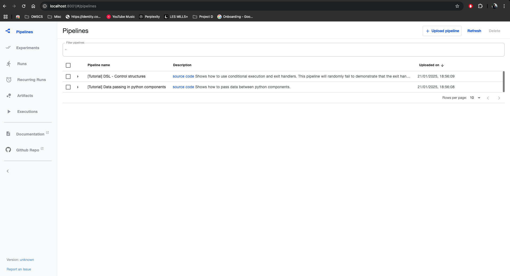

# Installation Guide

This whole setup should work fine on Minikube or any other flavour of Kubernetes. However, setting up all the components and hosting LLMs might require a little more than what your laptop can handle. In my case, I used Digital Ocean droplets to form a microk8s cluster which makes the creation of a multi-node kubernetes cluster with PVs etc. very straightforward.

## 1. Cluster Setup
1. Setup a microk8s cluster using [this script](./k8s/bootstrap/microk8s_setup.sh)
2. Add nodes to the microk8s cluster using the output of the command `microk8s add-node`
3. Setup argocd by running the [argocd installation script](./k8s/bootstrap/argocd_setup.sh). `bash ./k8s/bootstrap/argocd_setup.sh` should get the job done.
4. To view ArgoCD UI, run the following to obtain admin secret and setup port-forwarding
```shell
kubectl -n argocd get secret argocd-initial-admin-secret -o jsonpath="{.data.password}" | base64 -d && echo
kubectl -n argocd port-forward svc/argocd-server 8080:80 &
```

## 4. MLFlow Setup
1. Run the command `kubectl apply -f k8s/argocd_apps/mlflow.yaml`
2. Navigate to ArgoCD UI, navigate to the MLFlow app and click on "Details" then "Edit" then "Parameters" tab to replace the placeholder values of the artifactRoot.s3.awsAccessKeyId and artifactRoot.s3.awsSecretAccessKey with the accesskey credentials you created in the MinIO steps above

3. Next, click on "Sync"
4. Observe to ensure that everything gets setup correctly, including the logs of the mlflow pod

5. You can use `kubectl -n mlflow port-forward svc/mlflow-tracking 5000:80` to port-forward to the MLFlow server and UI


## 4. Kube-Ray & RayCluster
1. To setup KubeRay Operator, simply run `kubectl apply -f k8s/argocd_apps/kuberay-operator.yaml`
2. Navigate to ArgoCD UI and click on "Sync">"Synchronize"
3. Observe to ensure that everything gets setup correctly

4. Next, install a RayCluster by running `kubectl apply -f k8s/argocd_apps/raycluster.yaml`. Take a look at the image being used in this yaml file. Ensure that the python version is the desired version. The one being used here is py311 because later versions of garak with bufixes do not work with py39.
5. Navigate to ArgoCD UI and click on "Sync">"Synchronize"
6. Observe to ensure that everything gets setup correctly


## 5. Kubeflow Pipelines Setup
1. To setup Kubeflow Pipelines, simply run `kubectl apply -f k8s/argocd_apps/kfp.yaml`
2. Navigate to ArgoCD UI and click on "Sync">"Synchronize"
3. Observe to ensure that everything gets setup correctly

4. To view the KFP UI, port-forward using `kubectl -n kubeflow port-forward svc/ml-pipeline-ui 8001:80`

5. You can consider running the example pipeline using the UI to ensure everything is running smoothly


## 6. [Optional] ArgoWorkflows Setup
1. To setup ArgoWF, simply run `kubectl apply -f k8s/argocd_apps/argowf.yaml`
2. Navigate to ArgoCD UI and click on "Sync">"Synchronize"
3. Observe to ensure that everything gets setup correctly

4. Run the following command to obtain admin token required for login in the coming steps
`kubectl -n argowf exec -it $(kubectl get pods -n argowf | grep argo-workflows-server | awk '{print $1}') -- argo auth token`
5. To view the ArgoWF UI, port-forward using `kubectl -n argowf port-forward svc/argowf-argo-workflows-server 2746`
6. To login, stick the Bearer token obtained in and click "Login"

Voila!


